# Shiftly - A Seamless Transport System 🚚

<div align="center">
  
  
  [](https://reactjs.org/)
  [](https://tailwindcss.com/)
  [](https://nodejs.org/)
  [](https://www.mongodb.com/)
  [](https://expressjs.com/)
 
</div>

## 📖 Overview

**Shiftly** is a web-based transport system designed to facilitate seamless transportation of goods across India. Whether it's shifting household items during relocation or transporting industrial materials for businesses, Shiftly ensures a hassle-free experience by connecting customers with suitable vehicles and reliable drivers. The platform is built to simplify the process, ensure affordability, and maintain reliability for both customers and drivers.

The platform provides role-based dashboards for customers and drivers, supports real-time communication via WebSocket, and integrates with APIs like Google Maps, OpenRouteService, Twilio, and Clodinary. With Shiftly, both individual users and transport professionals can manage their shipments efficiently, affordably, and with full visibility.

## ✨Key Features

### 🔹For Customers

- **User Registration and Login**: Secure account creation with multiple authentication options (email, phone number, social logins).
- **Goods and Address Input**: Customers can enter pick-up and destination addresses, specify goods details, and use an AI estimation tool for unknown weights and sizes.
- **Vehicle Selection**: Displays a list of vehicles suitable for the goods based on size and weight.
- **Driver Bidding System**: Customers can compare bids from drivers based on distance, size, and type of goods.
- **Dynamic Pricing Model**: Pricing is calculated based on distance, weight, volume, vehicle type, and time of day.
- **Booking and Scheduling**: Customers can book vehicles for immediate or future transport with a flexible calendar interface.
- **Live Tracking**: Real-time tracking of goods through a GPS-enabled interface.
- **Public Tracking Link**: Customers can generate a public tracking link and share it with others. This link allows recipients to view real-time delivery progress without logging into the system.
- **Customer Feedback System**: Customers can rate drivers and provide feedback to maintain platform quality.

### 🔹For Drivers

- **Driver Registration and Login**: Secure account       creation and login for drivers with OTP verification in both email and mobile number.
- **View Available Bookings** : See nearby jobs in real time and filter based on vehicle compatibility.
- **Bidding System** : Submit price quotes for active bookings and include ETA or notes.
- **Delivery Status & Tracking** : Update delivery status and send live location updates via Socket.io.

- **Earnings Dashboard**: Track income, completed jobs, and customer ratings.

### ❓What is this Bidding System?
Once a customer enters their transport details, Shiftly generates a price range. Drivers in the area can bid an amount within this range, and the customer selects the driver based on price, rating, and availability. The drivers can also update their bids anytime giving them the flexibility to be competitive with other drivers.


##  🛠️ Technologies Used

### ⚙️ Frontend
- **React.js** – Frontend UI framework for SPA architecture  
- **Tailwind CSS** – For modern, responsive styling  
- **Framer Motion** – Animations and transitions  
- **React Router** – Page routing for customer/driver views  
- **Socket.io-client** – For real-time updates

### ⚙️ Backend
- **Node.js + Express.js** – Server-side logic and RESTful APIs  
- **Socket.io** – Real-time communication (bidding, tracking)  
- **JWT** – Authentication and role-based access  
- **Bcrypt** – Password hashing for secure storage  
- **Multer** – File uploads  
- **dotenv** – Environment configuration

### ⚙️ Database
- **MongoDB (Atlas)** – NoSQL cloud database for scalable data handling

### ⚙️ APIs & Integrations
- **Google Maps API** – Address autocomplete and map rendering  
- **OpenRouteService API** – Distance calculations   
- **Twilio** – SMS OTP verification and notifications  
- **Nodemailer** – Email-based OTP and alerts  
- **Cloudinary** – Cloud storage for images and documents


## 🚀 Getting Started

### Prerequisites
- [Node.js (v18 or higher)](https://nodejs.org/en/download)
- [MongoDB](https://www.mongodb.com/)
- npm or yarn
- [Google Maps API key](https://console.cloud.google.com/)
- [OpenRouteService Account](https://openrouteservice.org/)
- [Twilio Account](https://www.twilio.com/en-us)
- [Cloudinary Account](https://cloudinary.com/)


### Installation
⚠️ **Important:** Run each directory (`backend`, `frontend`, `Driver`) in separate terminals to start the full system correctly.

1. **Clone the Repository**
   ```bash
   git clone https://github.com/Shaw145/Shiftly.git
   cd Shiftly
   ```

2. **Backend Setup**
   ```bash
   cd backend
   npm install
   ```

   Create a `.env` file in the `backend` directory:
   ```env
   PORT=5000
   BACKEND_URL=http://localhost:5000
   FRONTEND_URL=http://localhost:5173  
   FRONTEND_URL_DRIVER=http://localhost:5174

   MONGO_URI=your_mongodb_uri

   JWT_SECRET=your_jwt_secret
   

   CLOUDINARY_CLOUD_NAME=your_cloudinary_cloud_name
   CLOUDINARY_API_KEY=your_cloudinary_api_key
   CLOUDINARY_API_SECRET=your_cloudinary_api_secret

   TWILIO_ACCOUNT_SID=your_twilio_account_sid
   TWILIO_AUTH_TOKEN=your_twilio_auth_token
   TWILIO_PHONE_NUMBER=your_twilio_phone_number

   EMAIL_USER=your_email_for_sending_emails
   EMAIL_PASSWORD=your_email_password
   ```

3. **Frontend/Customer Setup**
   ```bash
   cd frontend
   npm install
   ```

   Create a `.env` file in the `frontend` directory:
   ```env
   VITE_BACKEND_URL=http://localhost:5000
   VITE_FRONTEND_DRIVER_URL="http://localhost:5174/signup"
   VITE_GOOGLE_MAPS_API_KEY=your_google_maps_api_key
   VITE_OPENROUTE_API=your_openrouteservice_api_key
   ```

4. **Driver Setup**
   ```bash
   cd Driver
   npm install
   ```

   Create a `.env` file in the `Driver` directory:
   ```env
   VITE_BACKEND_URL=http://localhost:5000
   VITE_WS_URL=ws://localhost:5000/ws
   VITE_API_URL=http://localhost:5000
   VITE_GOOGLE_MAPS_API_KEY=your_google_maps_api_key
   ```
   use `VITE_WS_URL=wss://[Backend_URL]/ws` for real deployment

5. **Start the Application**
   ```bash
   # Start backend (from backend directory)
   npm start

   # Start frontend (from frontend directory)
   npm run dev

   # Start Driver (from Driver directory)
   npm run dev
   ```

### Important Notes

#### Twilio SMS Verification
Before using Twilio for SMS notifications:
1. Sign up for a Twilio account (Free trial available)
2. Verify your phone number in Twilio console
3. For free trial accounts:
   - You must verify each phone number that will receive SMS
   - Go to Twilio Console → Phone Numbers → Verified Caller IDs
   - Add and verify the phone numbers
   - Only verified numbers can receive SMS in trial accounts
4. For production:
   - Upgrade to a paid account
   - No need to verify numbers
   - Higher SMS limits
   - Additional features available


## 📱 Usage Guide
   Once the app is running, visit:
   - `http://localhost:5173` → **Customer frontend**
   - `http://localhost:5174` → **Driver frontend**
   - `http://localhost:5000` → **Backend API**  

### 🧑‍💼 Customer Flow

1. **Register/Login**
   - Sign up with email, verify the email and complete profile
2. **Create a Booking**
   - Enter pickup/drop addresses, goods details, and schedule
3. **Select a Bid**
   - Compare live bids and choose the preferred driver
4. **Live Tracking**
   - Track the vehicle on Google Maps and receive status updates
5. **Rate Driver**
   - Submit feedback once delivery is completed

### For Drivers

1. **Register/Login**
   - Sign up with email and mobile number, Submit profile info, vehicle docs, and availability
2. **View Bookings & Bid**
   - Check available bookings and submit competitive bids
3. **Manage Deliveries**
   - Accept bookings, update delivery status, and share live location
4. **Track Earnings**
   - View completed jobs and total income


## 📌 Future Enhancements

- Integration of the **OCSE AI Model** for image-based shipment classification, weight prediction, vehicle recomendation and price estimation.
- **Mobile app** development for Android and iOS  
- **Multilingual support** for wider accessibility  
- **Admin dashboard** for managing users, drivers, and complaints  
- **End-to-end transport service** with Shiftly-owned fleet (long-term)


## 📸 Demo Screenshots


### 👤 Customer Interface

- **🏠 Home Page**  
  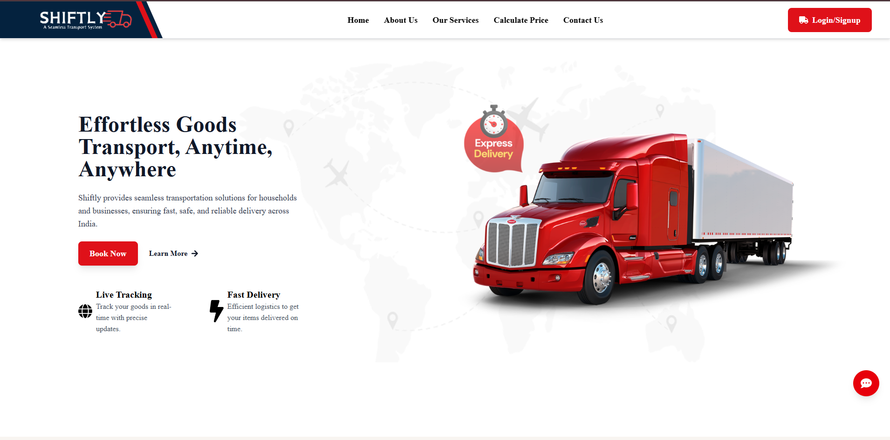

- **🔐 Login Page**  
  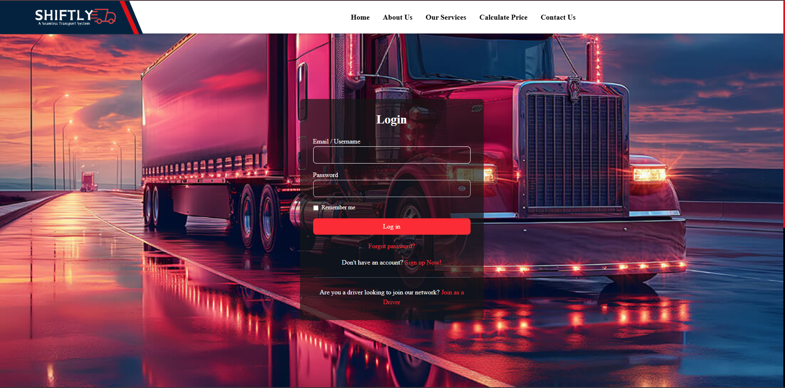

- **📊 Customer Dashboard**  
  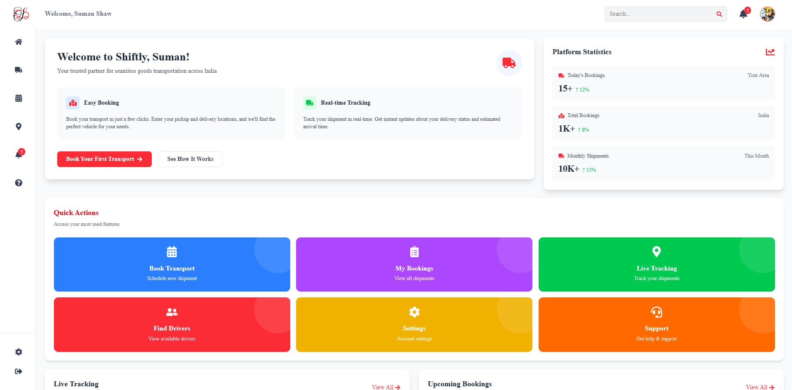

- **👤 Profile Management**  
  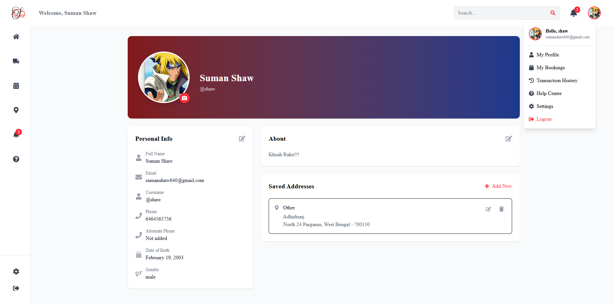

- **📦 Booking Interface**  
  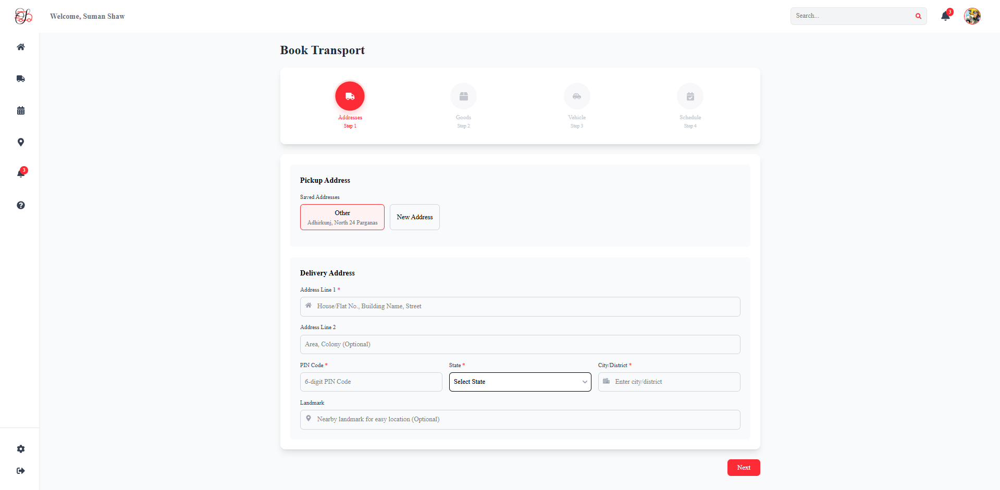

- **💸 Driver Bids**  
  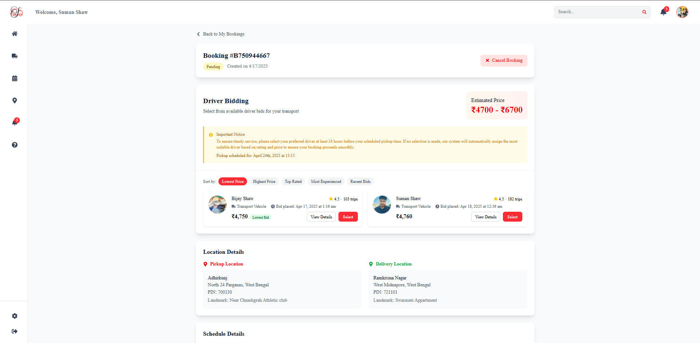

- **📍 Live Tracking View**  
  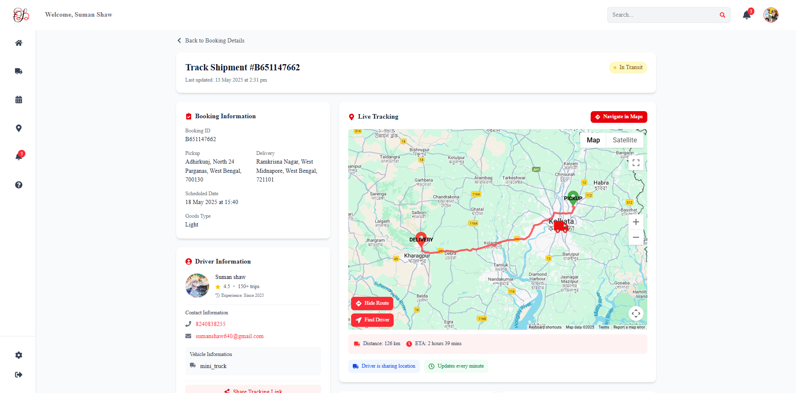

- **🔗 Public Tracking View (Shared Link)**  
  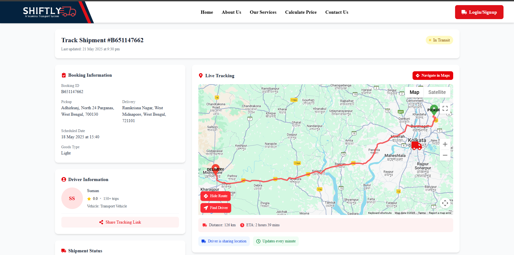

---

### 🚚 Driver Interface

- **🔐 Driver Sign Up Page**  
  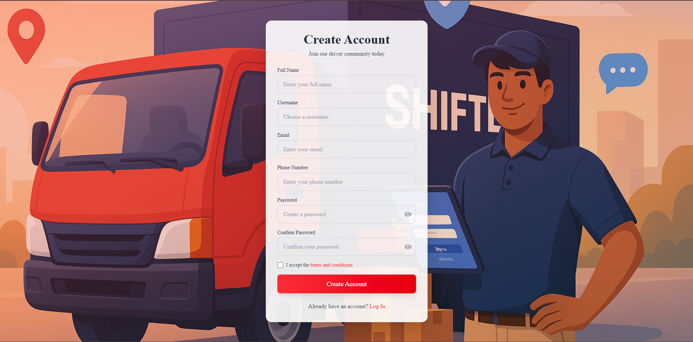

- **📊 Driver Dashboard**  
  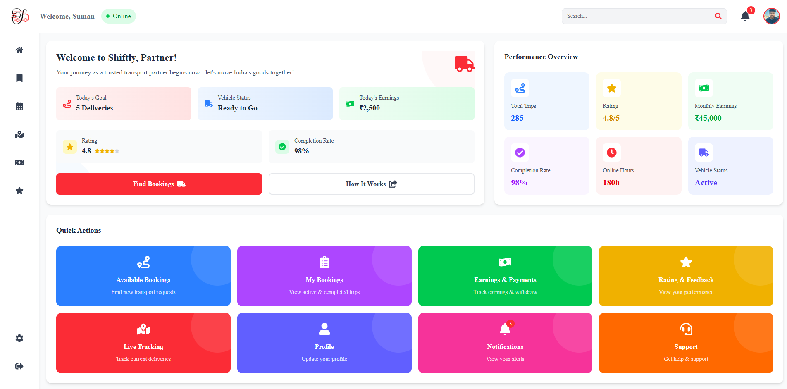

- **👤 Profile Management**  
  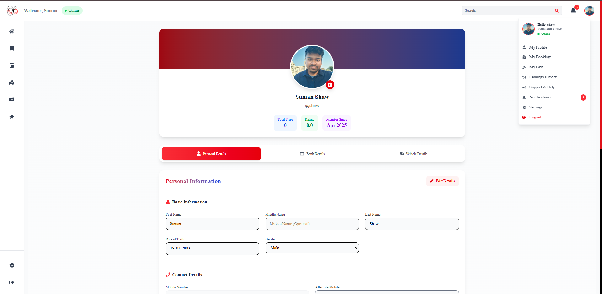

- **📦 Available Bookings Page**  
  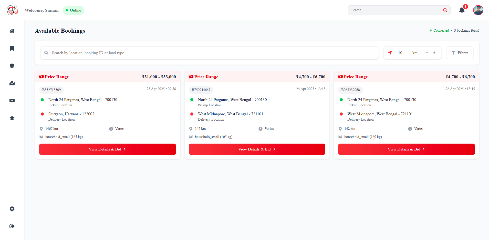

- **💸 Bid Submission Panel**  
  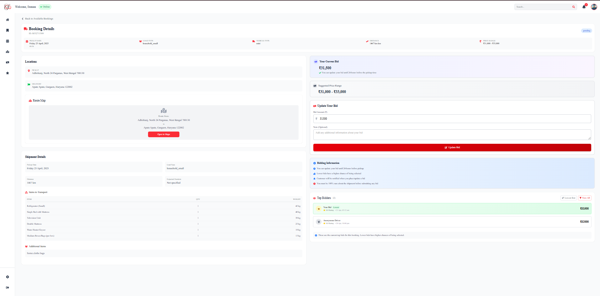

- **📍 Location Sharing**  
  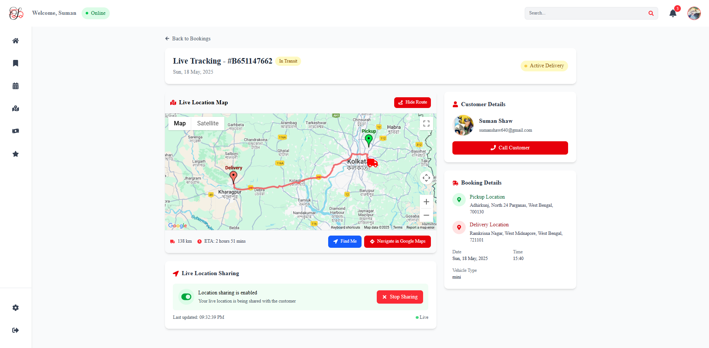


## 👥 Authors

- **Suman Shaw** - *Lead Full Stack Developer* - [GitHub](https://github.com/Shaw145) | [Linkedin](https://www.linkedin.com/in/sumanshaw/)
- **Sudipto Das** - *Backend Developer* - [GitHub](https://github.com/sudiptodas369) | [Linkedin](https://www.linkedin.com/in/sudipto-das-sudi369/)
- **Swarnali Das** - *UI/UX Designer* - [GitHub](https://github.com/swarnali03) | [Linkedin](https://www.linkedin.com/in/swarnali-das-b087a0288/)
- **Sujash Das** - *Frontend Developer* - [GitHub](https://github.com/Sujash-1210) | [Linkedin](https://www.linkedin.com/in/sujashdas1210/)
- **Subhadeep Dutta** - *Frontend Developer* - [GitHub](https://github.com/Subhodeep142002) | [Linkedin](https://www.linkedin.com/in/subhodeep-dutta-636229270/)


<!-- ## License

This project is licensed under the MIT License - see the [LICENSE](LICENSE) file for details. -->

## 💬 Note from the Developers

This project represents our first big full-stack development effort, built with passion, learning, and collaboration. While we’ve worked hard to implement key features and design a scalable system, we acknowledge that the codebase may not be fully optimized or free of bugs.

Some features are still haven't developed yet or pending refinement. We appreciate your understanding and welcome constructive feedback to help us improve. Thank you for checking out **Shiftly**.

---

Shiftly aims to revolutionize goods transport in India by providing a digital solution that bridges the gap between customers and transport service providers. The platform focuses on affordability, efficiency, and customer satisfaction, making it a win-win for all stakeholders involved.


---

<div align="center">
  

<div align="center" marginTop='100px'>
  Made with ❤️ by Team @CodeCrafters
</div>


